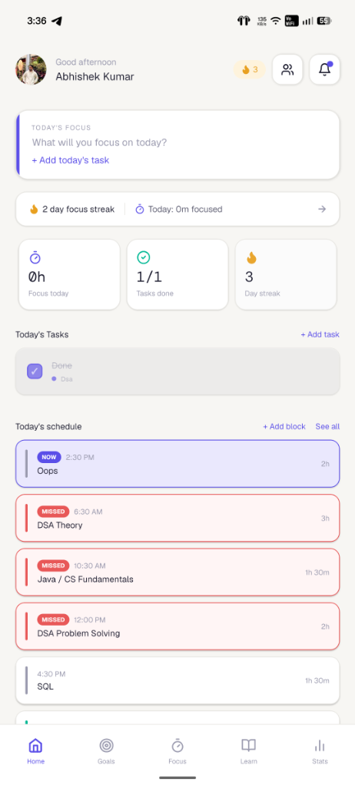
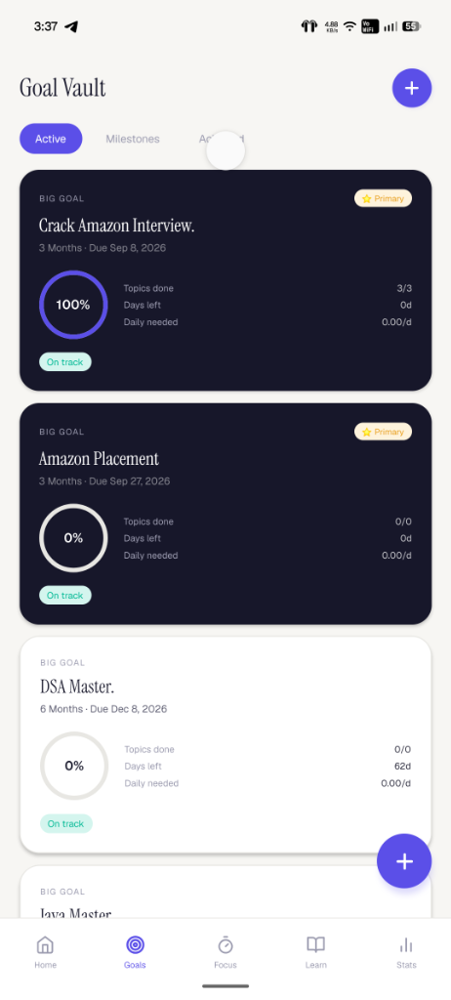
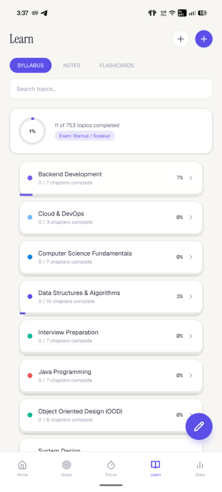
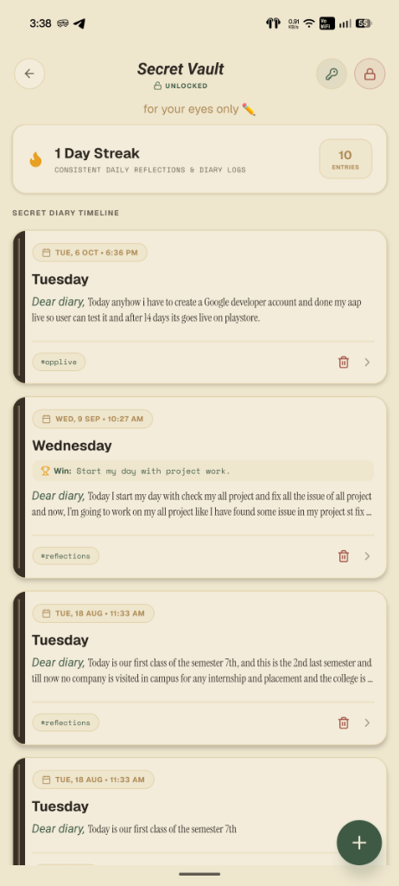
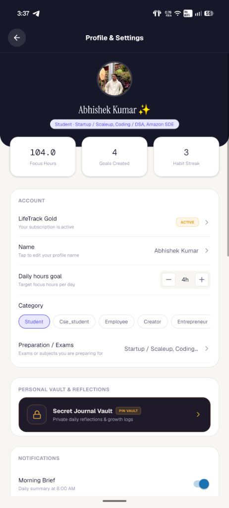

<div align="center">

  

  # LifeTrack Pro
  ### *The Ultimate Life Operating System*

  **One App. Every Goal. Absolute Consistency.**

  [](https://expo.dev)
  [](https://docs.expo.dev)
  [](https://www.typescriptlang.org)
  [](https://supabase.com)
  [](./LICENSE)

  <br />

  [📱 Explore App](#-app-showcase) · [🚀 Features](#-core-features) · [🛠️ Tech Stack](#%EF%B8%8F-technology-stack) · [⚡ Quick Start](#-getting-started) · [🔒 Security](#-security--privacy)

</div>

---

## 📖 Overview

**LifeTrack Pro** is an all-in-one productivity power-suite built for ambitious students, professionals, creators, and exam aspirants (NEET, JEE, UPSC, SDE Placement Prep) who want to bridge the gap between long-term ambition and daily execution.

Unlike fragmented task apps, **LifeTrack Pro** unifies **Goal Pacing**, **Daily Routines**, **Deep Work Focus Timers**, **Physical Vintage Journaling**, **Exam Syllabus Maps**, and **Realtime Study Rooms** into a single, seamless ecosystem.

---

## 📱 App Showcase

<div align="center">

| **Home Dashboard** | **Goal Vault** | **Learn & Syllabus** |
|:---:|:---:|:---:|
|  |  |  |
| *Focus Card & Routines* | *Goal Hierarchy & Pacing* | *Exam Syllabus & Notes* |

<br />

| **Secret Journal Vault** | **Profile & Stats** |
|:---:|:---:|
|  |  |
| *Vintage Physical Diary* | *Focus Analytics & Vault Lock* |

</div>

---

## 🚀 Core Features

### 🏠 1. Executive Home Dashboard
- **Focus Launcher**: Highlight top priority micro-commitments and launch 25-minute Pomodoro sessions in **1 tap**.
- **Schedule Strip**: Live horizontal timeline tracking today's routine blocks (Active, Completed, Missed, Skipped).
- **Streak & Analytics Summary**: Realtime feedback on focus hours logged, task completions, and daily streaks.

### 🏆 2. Goal Vault & Dynamic Pacing
- **4-Level Hierarchy**: `Big Goal` → `Milestones` → `Weekly Tasks` → `Daily Action Items`.
- **Automated Pacing Engine**: Live status calculation (`🟢 On Track`, `🟡 At Risk`, `🔴 Behind`) based on time remaining vs. completion velocity.

### ⏱️ 3. Smart Focus Mode & Audio Engine
- **Pomodoro Presets**: Standard 25/5, 50/10, 90/20, or custom duration timers.
- **Ambient Soundscapes**: 5 high-fidelity audio tracks (*Rain*, *Café*, *Ocean*, *Lo-Fi*, *Brown Noise*) running on native background players (`expo-audio`).
- **Zero Distraction Guarantee**: Ads are automatically suppressed during active focus sessions.

### 🔒 4. Physical Vintage Journal Vault
- **Aesthetic Diary Theme**: Parchment paper background, red notebook margin lines, and vintage `InstrumentSerif` handwriting typography.
- **PIN Lock & Password Recovery**: 4-digit PIN protection backed by Supabase Auth password verification for instant recovery.
- **Structured Daily Growth Logs**: Track `Daily Thoughts`, `Wins of the Day`, `Not To-Dos`, and `Improvements`.

### 📚 5. Syllabus Tracker & Spaced Repetition
- **Multi-Exam Syllabus Maps**: Pre-configured chapter maps for UPSC CSE, NEET, JEE, GATE, and SDE Placement Prep.
- **SuperMemo SM-2 Flashcards**: Memory retention algorithm scheduling revision intervals based on recall difficulty.

### 👥 6. Realtime Study Rooms
- **Synchronous Collaboration**: Live presence sync (`Supabase Realtime`) showing active participants, silent/music/discussion room modes, and shared room timers.
- **In-Room Chat**: Realtime sanitized room messaging with client-side rate limiting and anti-phishing filters.

---

## 🛠️ Technology Stack

| Layer | Technologies Used |
|---|---|
| **Framework** | [React Native 0.86](https://reactnative.dev) + [Expo SDK 57](https://expo.dev) |
| **Language** | [TypeScript 5.0](https://www.typescriptlang.org) (Strict Mode) |
| **Routing** | [Expo Router v4](https://docs.expo.dev/router/introduction/) (File-based navigation) |
| **Backend & DB** | [Supabase](https://supabase.com) (PostgreSQL 15, Auth, Row-Level Security, Realtime, Storage) |
| **State & Cache** | [Zustand](https://github.com/pmndrs/zustand) + [TanStack React Query v5](https://tanstack.com/query/v5) |
| **Audio Engine** | `expo-audio` (SDK 57 native background audio player) |
| **UI & Animations** | Lucide React Native, React Native Reanimated v4, Custom Design Tokens |
| **Observability** | Sentry React Native (Automated crash logging & performance tracing) |

---

## ⚡ Getting Started

### Prerequisites
- **Node.js**: v20.0.0 or higher
- **Package Manager**: `npm` or `yarn`
- **Mobile Environment**: [Expo Go](https://expo.dev/go) app, iOS Simulator, or Android Emulator

### 1. Clone the Repository
```bash
git clone https://github.com/abhishekkumar74/LifeTrackPro.git
cd LifeTrackPro
```

### 2. Install Dependencies
```bash
npm install
```

### 4. Run Development Server
```bash
# Start Metro bundler
npm start

# Run on iOS Simulator
npm run ios

# Run on Android Device / Emulator
npm run android
```

---

## 🧪 Quality Assurance & Build Checks

Verify project health and configuration using built-in scripts:

```bash
# Type check TypeScript files
npx tsc --noEmit

# Validate AdMob safety & configuration
npm run validate:ads

# Validate Expo public configuration
npx expo config --type public
```

---

## 🔒 Security & Privacy

- **100% PostgreSQL Row-Level Security (RLS)**: Every single table restricts `SELECT`, `INSERT`, `UPDATE`, and `DELETE` access exclusively to the authenticated owner (`user_id = auth.uid()`).
- **Zero Frontend Secret Exposure**: Service role keys, database credentials, and signing secrets are strictly omitted from frontend builds.
- **Encrypted Local Storage**: Auth sessions and PIN hashes use `AsyncStorage` with native secure storage options.

---

## 📄 License

Distributed under the **MIT License**. See [`LICENSE`](./LICENSE) for more information.

---

<div align="center">
  <sub>Crafted with ❤️ for ambitious builders and high achievers worldwide.</sub>
</div>
